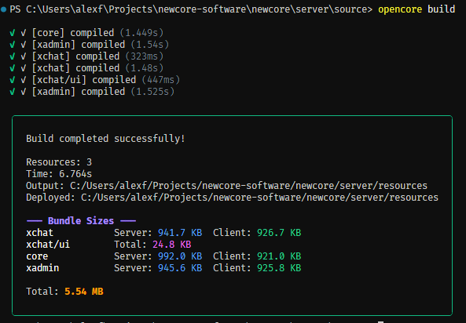
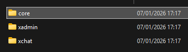
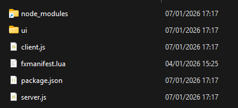

## 1. The Entry Point

Create a server-side entry file (e.g., `server/index.ts`). You must initialize the `Server` application before defining controllers.

### Server
```typescript
// server.ts
import { Server } from '@open-core/framework' // Server Namespace

// 1. Initialize the Application
Server.init({
    mode: 'CORE',
    features: {
        netEvents: {enabled: true},
        commands: {enabled: true},
        players: {enabled: true},
        exports: {enabled: true},
        principal: {enabled: true},
        auth: {enabled: true},
        chat: {enabled: true},
        database: {enabled: true},
        fiveMEvents: {enabled: true},
        http: {enabled: true},
        sessionLifecycle: {enabled: true}
    },
    devMode: {
        enabled: true
    }
}).catch( error => {
    console.error(error)
}).then(()=> {
    console.log('OpenCore [core] server initialized!')
    emit('core:ready')
})
```

It would be the same for the client

### Client
```typescript
// client.ts
import { Client } from '@open-core/framework';

Client.init({
    mode: 'CORE'
}).catch( error => {
    console.error(error)
}).then(()=> {
    console.log('newcore client initialized!')
})
```
## 2. Creating Your First Controller

Controllers are the entry points for your logic. They handle commands, network events, and ticks.

### Server:
```typescript
// src/server/controllers/hello.controller.ts
import { Server, z } from '@open-core/framework'

@Server.Controller()
export class HelloController {

  @Server.Command({
    command: 'hello',
    schema: z.tuple([z.string().optional()]), // Validate args
    usage: '/hello [name]',
  })
  public onHelloCommand(player: Server.Player, args: [string | undefined]) {
    // The first parameter will always be the player or no parameters.
    const name = args[0] || player.name
    console.log(`Hello command received from ${player.name}`)
    player.send('Welcome to newcore', 'chat')
    emitNet('bye:event', 'bye!')
  }
}
```
### Client:
```typescript
// src/client/controllers/bye.controller.ts
import { Client } from '@open-core/framework'

@Client.Controller()
export class ByeController {

  @Client.OnNet('bye:event')
  public handleByeEvent(message: string) {
    console.log(`server say: ${message}`) // server say bye!
  }
}
```

### Important!

You need to import your controllers in your main server or client file, otherwise it won't work!
```ts
// server.ts
import { Server } from '@open-core/framework'
import './controllers/hello.controller.ts'

Server.init({
    mode: 'CORE',
    features: {...}
```


## 3. Building & Running

Since OpenCore uses TypeScript, you need to compile your code before running it in FiveM. For this you can simply use the compiler integrated into the CLI (powered by Esbuild and SWC).
This will automatically perform parallel builds to make things easier—one project workspace for multiple final builds! Pretty cool, right?
```bash
opencore build
```





if you want use your own compiler, feel free to create script and build.js compiler, or you can also set a ``compilerCustom`` for a single resource with the CLI. [Read more](../cli/commands.md)
