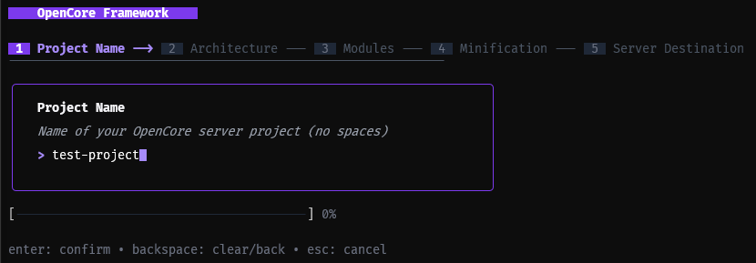

- Node.js v22+ (LTS recommended)
- PNPM (Highly Recommended) or NPM/Yarn
- TypeScript knowledge

## 1. Let's start

OpenCore is distributed as an NPM package. You can add it to an existing resource or start a new project with our CLI!

### With our CLI *(Recommended)*
Install the CLI using npm
```bash
npm install -g @open-core/cli
```
and create a new opencore project
```bash
opencore init
```


that's create a monorepo with pnpm, with `core/`, `resources/*` and posible to add `standalones/*` repos
```ts
core/ // here is where you code your core-resource
resources/ // here are the others resources
views/ // views from your core
opencore.config.ts // config file for the project
package.json
pnpm-workspace.yml
tsconfig.json
```

```bash
cd ./your-project
pnpm install
```

and ready!

### from scratch:
```bash
pnpm add @open-core/framework reflect-metadata tsyringe zod
```

### Required Peer Dependencies

- `reflect-metadata`: For decorator support.
- `tsyringe`: For Dependency Injection.
- `zod`: For input validation schemas.

## 2. Configurations

OpenCore relies heavily on decorators. You **must** enable specific compiler options in your `tsconfig.json`.

```json
{
  "compilerOptions": {
    "target": "ES2020",
    "module": "commonjs",
    "experimentalDecorators": true, // REQUIRED
    "emitDecoratorMetadata": true, // REQUIRED
    "strict": true,
    "esModuleInterop": true,
    "skipLibCheck": true
  }
}
```

### [First Server](../getting-started/first-server.md) 